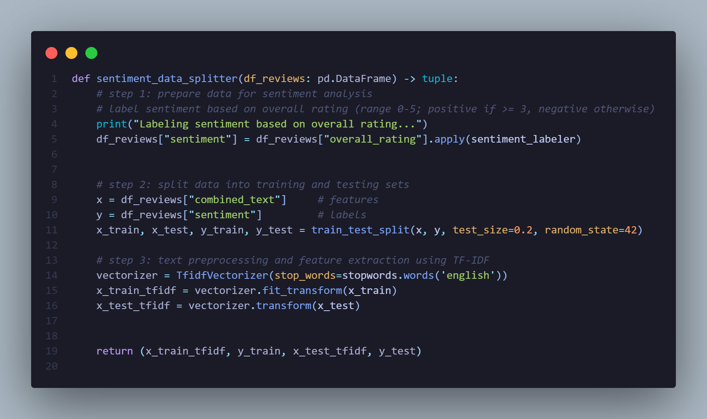
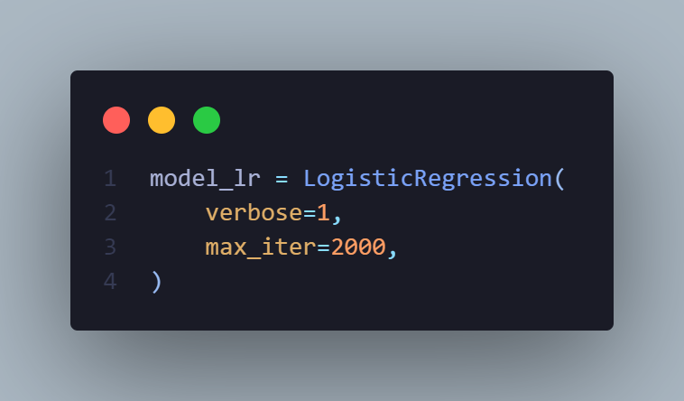
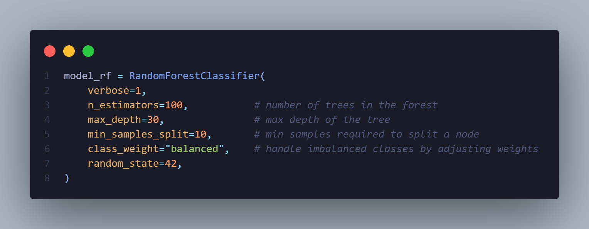
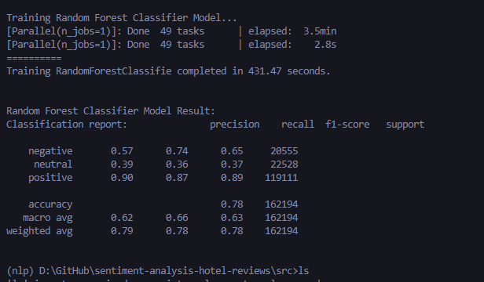

# sentiment-analysis-hotel-reviews
 Build a model to analyze customer sentiment from hotel reviews (positive, neutral, or negative).


### Dataset 
<a href="https://www.kaggle.com/datasets/joebeachcapital/hotel-reviews">
    
</a><br />

URL: [TripAdvisor Hotel Reviews on Kaggle](https://www.kaggle.com/datasets/joebeachcapital/hotel-reviews) The folder contains:
- `offering.txt`
- `offerings.csv`
- `review.txt`
- `reviews.csv`

*(Note: In this repository, ignore `review.txt` and `reviews.csv` due to Git LFS limitations. xD)*

<br />

In my **`main.py`**, only `offerings.csv` and `reviews.csv` are used.
```cpp
df_offerings: [4333]row x [8]col
```
```cpp
df_reviews: [810967]row x [11]col
```

## Data splitting:
by `test_size = 0.2` <br />
<br />


# Machine Learning Model:
> ## 1. Logistic Regression Result:
> Labels: [`positive`, `neutral`, `negative`]<br />
> Configuration:<br />
> <br />
> **Accuracy: 0.87**<br />


<br />
<br />

> ## 2. Random Forest Classifier Result:
> Configuration: <br />
> <br />
> **Accuracy: 0.78** <br />
> 

