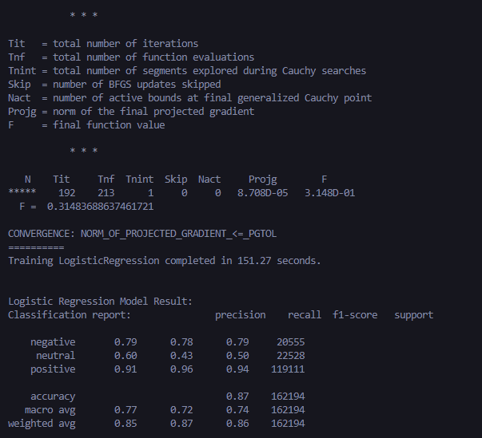

# sentiment-analysis-hotel-reviews
 Build a model to analyze customer sentiment from hotel reviews (positive, neutral, or negative).


### Dataset 
URL: [TripAdvisor Hotel Reviews on Kaggle](https://www.kaggle.com/datasets/joebeachcapital/hotel-reviews) The folder contains:
- `offering.txt`
- `offerings.csv`
- `review.txt`
- `reviews.csv`

(Note: In this repository, ignore `review.txt` and `reviews.csv` due to Git LFS limitations. xD)

In my **`main.py`**, only `offerings.csv` and `reviews.csv` are used.
```cpp
df_offerings: [4333]row x [8]col
```
```cpp
df_reviews: [810967]row x [11]col
```


## Logistic Regression Result:
Configuration: `max_iter=2000`, `test_size=0.2`<br />
Labels: [`positive`, `neutral`, `negative`]<br />
**Accuracy: 0.87**<br />


